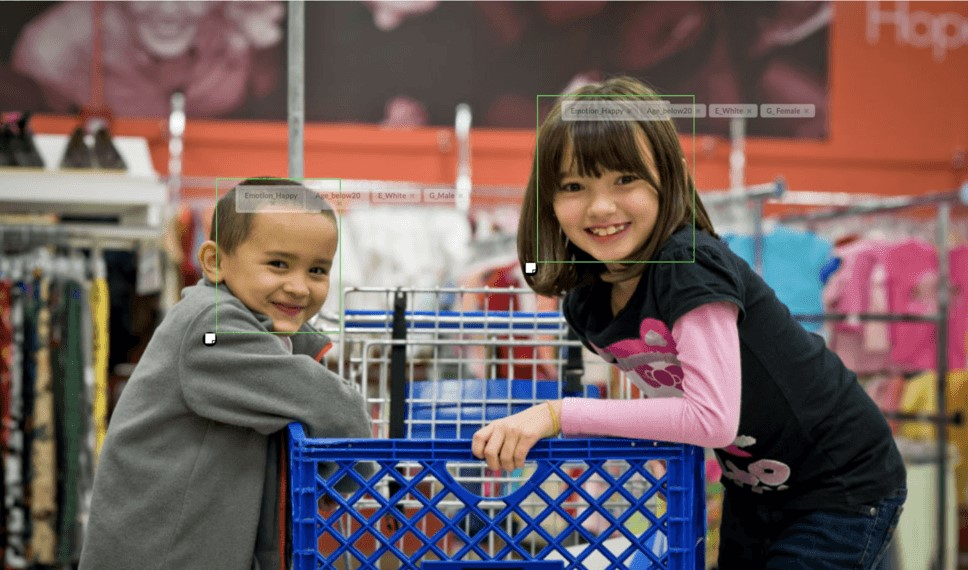

# TCS-HumAIn-2019-Age-Emotions-Ethnicity-Gender-Predictions-Using-Computer-Vision
This repository contains the submission for TCS HumAIn 2019- fifth problem statement which consists of facial recognition and age_ethnicity_gender_emotion predictor using computer vision tehniques.

## Solution Approach
1) Make a directory as follows:
```
->dataset
      ->age
          ->below_20
          ->20-30
          ->30-40
          ->40-50
          ->above_50
        
      ->emotions
          ->angry
          ->happy
          ->neutral
          ->sad
               
       ->ethnicity
          ->arab
          ->asian
          ->black
          ->hispanic
          ->indian
          ->white
        
       ->gender
          ->M
          ->F

```
2)The data_preprocessing_and_model_training.py and Data_Preprocessing_and model_training.ipynb contains the data preprocessing and model training code. The images from Facial_Recognition.json needs to be fetched along with the annotations and lables. After fetching the images, the facial regions are extracted and saved using the provided coordinates in the annotations. OpenCV library for computer vision is used for this purpose.

3)The facial images are then splitted in their respective categories like emotions,ethnicity,age and gender - using advanced pythonic code.(Making the directories as in step 1 is essential for splitting).

4)The images are converted into 70x70 pixels , and are further preprocessed for model training on a Convolutional Neural Network(CNN).

5)After the model are trained, they are ready for predictions. Integrating a webpage with these prediction models using Flask framework can be useful as users can interact with the models through a responsive user-friendly website. Users can choose a file from their system, upload it to the Flask server and get the predictions back in a user friendly format.

## Final Result- After Applying above solution on images.

